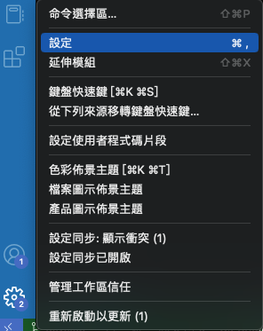

# Extension `CodeRunner`

'Code Runner' 是便於在 VSCode 中編譯及執行各種程式語言的腳本程式，透過按鈕來一鍵編譯及執行程式碼的小工具。

# 於 VSCode 中呼叫命令行介面

此舉可使編譯及執行按鈕呼叫 VSCode 中的命令行下達指令，令調試更為方便快捷。

### 1. 選擇 >> 左側菜單中，最下方的齒輪 Logo
### 2. 選擇 >> 設定

### 3. 搜尋 >> 在設定首頁最上方，搜尋 "Run in Terminal"
### 4. 勾選 >> Code-Runner: Run in terminal 欄位

### 5. 程式碼編譯與執行 >> 在程式碼文件右上角有一個播放按鈕，點擊下選菜單，選擇 "Run Code"

### 6. 選擇正確的話，會是一個單純的播放按鈕(沒有蟲子符號)
|Logo                              |Description
|:--------------------------------:|:----------
|  |正確樣式 ( 執行C/C++檔案的選項Logo與此相同，但無法執行，務必確定是 Run Code選項 )
| |錯誤樣式
### 7. 點擊播放按鈕後，會在下方彈出一個終端機窗口，顯示程式執行結果

