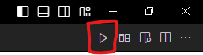

Visual Studio Code ( VSCode )

# ✨ Introduction 介紹
Visual Studio Code ( 以下簡稱 : [[VSCode]] ) 是一款由微軟開發的 ( [[Microsoft]] ) 開源、免費的[[跨平臺]]文本編輯器。與 Visual Studio ( 以下簡稱 : [[VS]] ) 不同的是，VSCode僅作爲文本編輯器，其自身非常輕巧，通過第三方擴展來實現各種功能，例如程式編譯、組態、除錯等，一般用於前端設計、預覽文件、程式練習等；而 VS 是一個完整的開發環境 [[IDE]], VS 嵌套了許多便於設計程式的開發工具、資源監控、錯誤追蹤等强大的功能，一般用於大型專案開發。

當然，VSCode 也可以開發大型專案，由於其本身沒有任何功能，僅僅是文本編輯器，所以要開發大型專案會需要懂得非常多客制化知識，不利於初學者使用，所以不建議使用 VSCode開發大型專案，除非你是大神，能夠玩弄 VSCode各種自定義指令，改到連微軟爸爸都不認識自己的親兒子 VSCode。
  

# 🔨 Requirements 基本要求
請參考官網資訊
  

# 🔨 Download 下載地址
VSCode 官方網站 ( [下載連結](https://code.visualstudio.com/Download) )
  

# Extension 擴展 / 外挂 / 延申模組
## A. 模組管理功能
位於預設界面的左側工具欄中，該功能 Logo 如下圖所示：

## B. 模組管理界面
點擊 模組管理功能 Logo，將會展開模組管理界面，如下圖所示：

1. 最上方是搜尋欄，用於在網路市集中搜尋第三方所發佈的模組。
2. 其次是已安裝欄，會顯示當前安裝的模組及模組狀態。
3. 最下方是推薦欄，會自動推薦最近使用的項目所需的一些額外、受歡迎的擴展。
  

## C. 模組安裝、卸載、停用、版本切換方法
透過搜尋欄搜尋模組名稱，點選所需模組後，會跳出該模組的介紹頁面：

1. 安裝 ( Install )

未安裝的模組在介紹頁面會顯示安裝按鈕。
    
 
2. 卸載 / 解除安裝 ( Uninstall )

安裝後會顯示解除安裝的按鈕。
    
 
3. 切換版本 ( Other Version )

按鈕右側有一個符號 V，可以展開菜單安裝或切換另一個版本
    
 
4. 停用模組 ( Disable )

安裝模組後，會多一個停用按鈕，停用後該模組功能將立刻失效
    
 
5. 啓用模組 ( Enable )

停用模組後，會多一個啓用按鈕，啓用後該模組功能將立即生效
    
 
### (*注：部分模組需要重啓 VSCode 才會生效 )
  

## D. 模組推薦
### 1. Chinese
該模組用於： 將 VSCode 編輯器中文化 (*注：不代表所有模組都有漢化，所以大部分模組依舊以英文爲主)
Chinese (Traditional) 繁體中文
Chinese (Simplified)  簡體中文

    
 

### 2. Code Runner
該模組用於： 提供一個按鈕，通過脚本自動化**編譯**及**執行程式碼**

安裝後，打開任意文件，右上角將會出現一個播放按鈕，如下圖紅色框中所示：

點擊該播放按鈕，會自動執行配置文件中的脚本指令
    
 

### 3. C/C++
該模組用於： C與C++程式碼的智能函數菜單、除錯等功能

    
 

### 4. Todo Tree
該模組用於： 標記高亮指定格式的標簽，并且整合出任務列表及待辦、注意事項

    
 

### 5. One Dark Pro
該模組用於： VSCode 主題風格

    
 

### 6. Material Icon Theme
該模組用於： VSCode 文件圖標

    
 

### 7. Local History
該模組用於： 本地文件夾内容自動備份

    
 

### 8. indent-rainbow
該模組用於： 文本縮排對齊色

    
 

### 9. Git Graph
該模組用於： 版本控制器視圖

    
 

### 10. Color Picker
該模組用於： 色彩選擇器，顯示顔色色碼的實際顔色

    
 

### 11. Code Spell Checker
該模組用於： 自動檢測英文字母拼寫，并提供錯誤修正

    
 

  

# 📔 Command 操作 & 指令集

TODO: Undone

